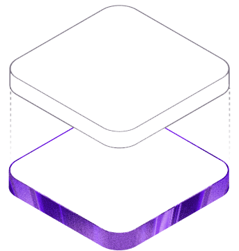

# OMEGA-1 // THE LAST SOFTWARE [AGI SYSTEM ENGINE]

<div align="center">



### **"SOFTWARE IS DEAD. RECURSIVE AGI IS HERE."**

[](https://vite.dev/)
[](https://react.dev/)
[](https://tailwindcss.com/)
[](./LICENSE)
[](https://github.com/m4hdiebene/Omega1)

</div>

---

## ⚡ Overview

**OMEGA-1** is a high-impact, interactive web application selling the concept of a sovereign **Artificial General Intelligence (AGI)** kernel designed to replace legacy software development, multi-SaaS subscriptions, and manual coding loops with zero-shot quantum tensor computation.

Built with a bold **Cyber-Brutalist / Neo-Brutalist** aesthetic, the platform features stark typography, raw geometric drop shadows, interactive 2D HTML Canvas particle visualizers, tactile Web Audio API synthesizer feedback, CRT scanline toggles, and seamless Dark/Light theme switching.

---

## 🚀 Key Modules & Capabilities

### 🧠 1. Neural Core Canvas Visualizer
- Interactive HTML5 2D Canvas rendering OMEGA-1's quantum particle cloud and synaptic force vectors.
- Real-time controls to adjust **Synapse Density**, **Quantum Entropy (Speed)**, and **Spectrum Wavelengths** (*Lime*, *Magenta*, *Cyan*, *Mono*).
- Interactive mouse/touch gravity displacement and Overclock pulse bursts.

### 💻 2. Reasoning Engine Demo Terminal
- Interactive simulated sandbox demonstrating OMEGA-1's zero-shot execution loop.
- Select presets (*Global Logistics Optimization*, *Legacy SaaS Code Deconstruction*, *Room-Temp Superconductor Synthesis*) to watch real-time step-by-step inner thought streams, token throughput timers, and cryptographic hex receipts.

### 📐 3. Technical Blueprint Inspector
- Interactive 4-Tier Node schematic breakdown:
  - `[01] Multi-Modal Perception Engine` (10 GB/s sensor telemetry stream)
  - `[02] Quantum-Tensor Latent Matrix` (100 Trillion parameter vector graph)
  - `[03] Recursive Self-Mutation Loop` (10ms autonomous kernel optimization)
  - `[04] Sovereign Action Dispatcher` (Direct hardware & API execution)

### 📊 4. Human Obsolescence & Compute ROI Calculator
- Interactive slider calculator estimating workforce cost reduction.
- Calculate legacy annual burn vs dedicated OMEGA-1 compute node allocation cost, net monetary savings ($ and %), and roadmap delivery acceleration.

### 📜 5. AGI Manifesto & Objections FAQ
- Unfiltered sales thesis detailing why human code scaffolding and SaaS subscriptions are obsolete.
- Interactive accordion FAQ addressing safety, cloud migration, and engineer role transition.

### 🔐 6. Compute Reservation & Staking Portal
- Multi-tier checkout modal (*Developer Node*, *Sovereign Cluster*, *Planetary Grid*).
- Generates 256-bit cryptographic access keys complete with celebratory particle confetti (`canvas-confetti`).

### 🔊 7. Web Audio API Brutalist Sound Engine
- Built-in tactile synthesizer generating mechanical clicks, parameter beep bursts, and success chord FX on user interaction (with header mute toggle).

### 🌓 8. Dark / Light Theme & CRT Scanline Toggle
- One-click instant theme switcher with dedicated Dark Mode (`#0A0A0C`) and Light Mode (`#F4F4F0`) color tokens and brutalist black drop shadows.
- Retro CRT scanline screen overlay toggle.

---

## 🛠 Tech Stack

- **Framework**: [React 19](https://react.dev/) + [Vite 8](https://vite.dev/)
- **Styling**: [Tailwind CSS v4](https://tailwindcss.com/) + Neo-Brutalist Utilities
- **Icons**: [Lucide React](https://lucide.dev/)
- **Graphics**: HTML5 2D Canvas API + [Framer Motion](https://www.framer.com/motion/)
- **Effects**: Web Audio API + [Canvas Confetti](https://www.npmjs.com/package/canvas-confetti)

---

## 💻 Local Setup & Installation

### Prerequisites
- [Node.js](https://nodejs.org/) (v18+ recommended)
- npm or pnpm

### Quick Start

1. **Clone the repository**:
   ```bash
   git clone https://github.com/m4hdiebene/Omega1.git
   cd Omega1
   ```

2. **Install dependencies**:
   ```bash
   npm install
   ```

3. **Start the development server**:
   ```bash
   npm run dev
   ```
   Open `http://localhost:5173/` in your browser.

4. **Build for production**:
   ```bash
   npm run build
   ```

---

## 📄 Repository Structure

```text
Omega1/
├── public/
│   ├── hero.png            # Readme preview screenshot
│   ├── favicon.svg         # Brutalist custom logo icon
│   └── icons.svg
├── src/
│   ├── assets/             # Brand graphics & icons
│   ├── components/         # Cyber-Brutalist React modules
│   │   ├── ArchitectureBlueprint.jsx
│   │   ├── ComputeCalculator.jsx
│   │   ├── ComputeStakingModal.jsx
│   │   ├── Footer.jsx
│   │   ├── Header.jsx
│   │   ├── HeroSection.jsx
│   │   ├── ManifestoSection.jsx
│   │   ├── MarqueeTicker.jsx
│   │   ├── NeuralCoreCanvas.jsx
│   │   └── TerminalPlayground.jsx
│   ├── utils/
│   │   └── audio.js        # Web Audio API sound synthesizer
│   ├── App.jsx             # Root layout with theme & audio state
│   ├── index.css           # Neo-Brutalist CSS design tokens
│   └── main.jsx
├── index.html
├── package.json
└── vite.config.js
```

---

## ⚖️ License

Distributed under the MIT License. See `LICENSE` for details.

---

<div align="center">
  <sub>Built for the Singularity by <b>OMEGA-1 AGI Systems Inc.</b></sub>
</div>
